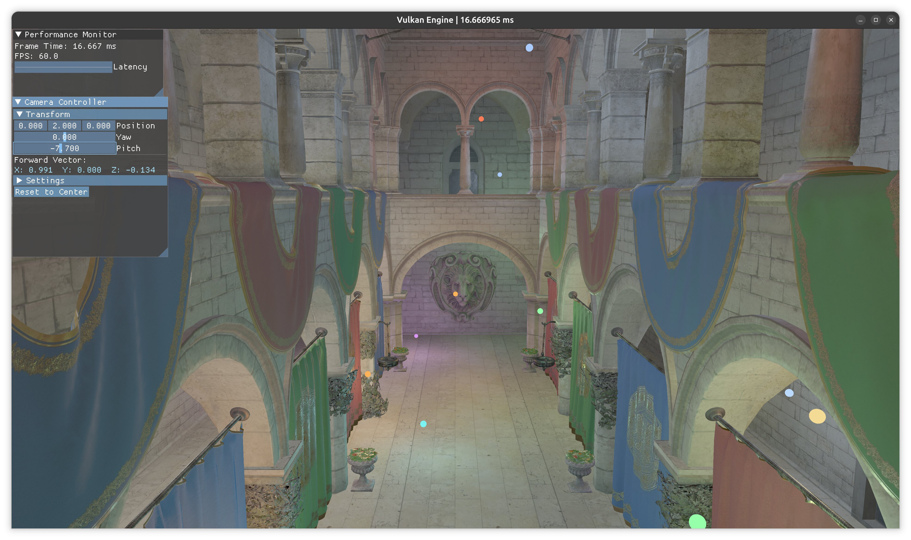
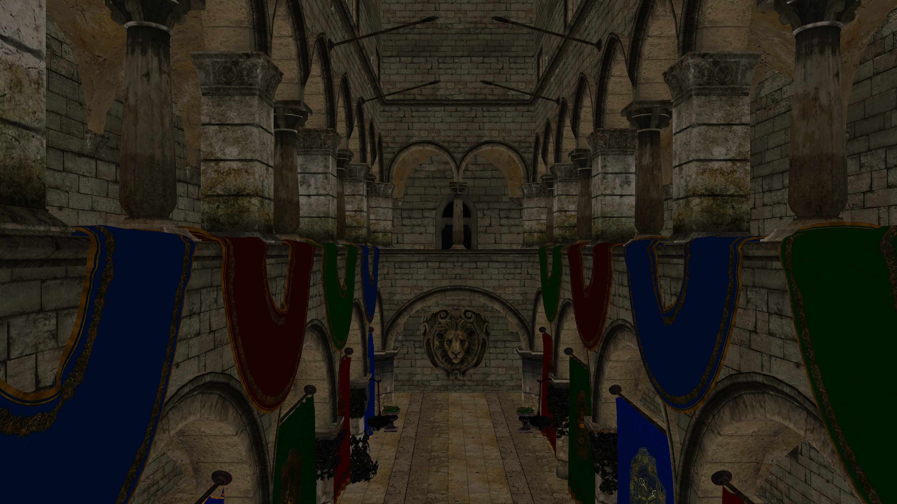
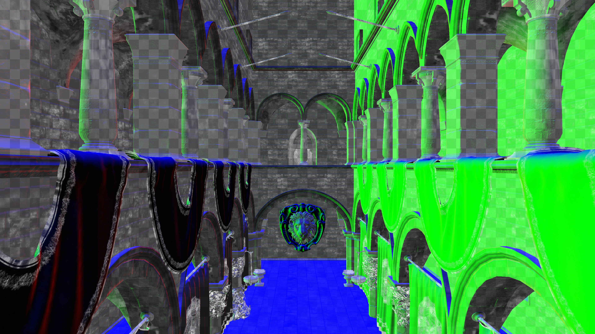
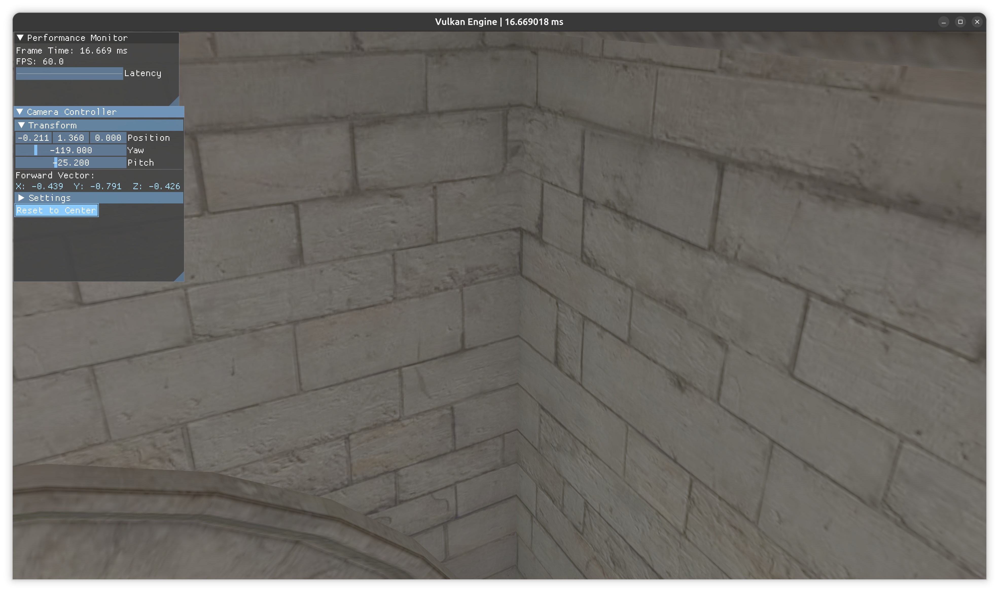
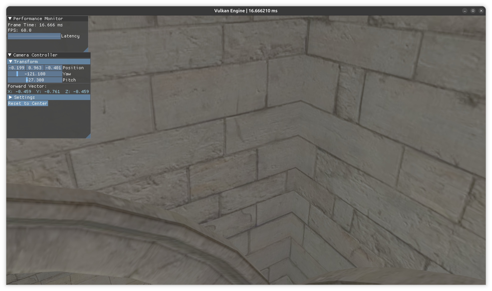
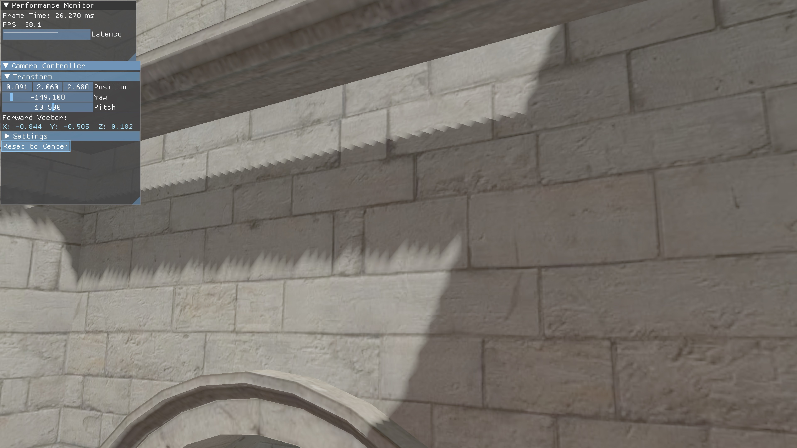
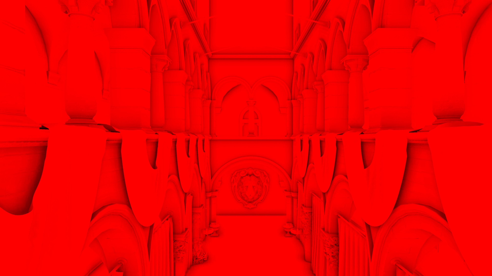
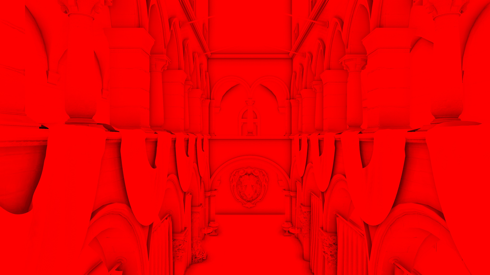

# defer_render

A Vulkan 1.3 deferred shading renderer built from scratch in C++23. Five render graph passes — shadow, geometry, SSAO, blur, lighting — managed by a compile-time barrier-deriving DAG with no hand-written synchronization in any pass. Built as a portfolio project targeting graphics/engine engineering roles.



---

## Screenshots

| Final Render (PBR + SSAO + Shadows) | Albedo RT | Normal + Roughness RT |
|---|---|---|
|  |  |  |

| SSAO On | SSAO Off | PCF Shadows |
|---|---|---|
|  |  |  |

| SSAO Blur On | SSAO Blur Off |
|---|---|
|  |  |

---

## Architecture

### Deferred Shading and G-Buffer

Deferred shading separates geometry from lighting: a geometry pass writes surface attributes to a small set of render targets (the G-buffer), then a fullscreen triangle evaluates lighting from those attributes. Lighting cost becomes proportional to screen pixels, not triangle count — 24 point lights cost the same regardless of scene complexity.

| RT | Format | Content | Bytes/pixel |
|----|--------|---------|-------------|
| RT0 | `R8G8B8A8_UNORM` | Albedo (rgb) + Metallic (a) | 4 |
| RT1 | `R16G16B16A16_SFLOAT` | World-space normal (xyz) + Roughness (a) | 8 |
| Depth | `D32_SFLOAT` | Shared with swapchain | 4 |
| **Total** | | | **16 bytes/pixel** |

**Position reconstruction.** World-space position is not stored. The lighting shader reconstructs it from the depth buffer using the inverse projection and view matrices. At 1080p (2,073,600 pixels), this eliminates a 16 bytes/pixel `R32G32B32A32_SFLOAT` render target — roughly 33 MB that would otherwise need to be written by the geometry pass and read by the lighting pass every frame. The trade-off is two matrix multiplies per pixel in the lighting pass, which is ALU-cheap on any modern GPU.

**Normal encoding.** World-space normals are stored as 16-bit float components (8 bytes/pixel). Octahedral encoding would halve this to 4 bytes/pixel at the cost of an encode/decode step. The current format is a deliberate simplicity choice; roughness packs cleanly into the alpha channel without a separate layout scheme. Oct encoding is a known next step.

**Reversed-Z.** `D32_SFLOAT` with reversed-Z: 1.0 at the near plane, 0.0 at the far. The hyperbolic depth distribution already clusters precision near the camera; reversed-Z reclaims that precision for the far field. Paired with an infinite far plane (projection derived from the limit as far → ∞), this eliminates the far-plane precision cost without changing geometry.

---

### Render Graph

Source: `src/renderer/passes/graph/`

The central architectural decision. This renderer has 5 graph-managed passes with 6 shared textures (shadow map, 2 G-buffer RTs, depth, SSAO buffer, blurred SSAO buffer). Each texture transitions through multiple layouts across the frame. Hand-writing those barriers would produce a frame loop that is fragile to pass reordering and difficult to audit. The render graph makes barriers a compiler output.

**Compile phase** (runs at startup and on swapchain resize):

Each pass declares its texture accesses: name, required layout, pipeline stage, and access flags. These are `constexpr std::string_view` names in `namespace texName` — a typo at a new pass declaration is a compile error, not a silent runtime mis-wire.

The compiler runs Kahn's topological sort to determine execution order from read/write dependencies. It then walks the sorted pass list, tracking current layout/stage/access per texture in a `TextureState` map. For each texture access it computes the minimal `vk::ImageMemoryBarrier2` needed to transition from the current state to the declared state, and bakes those barriers into `CompiledPass`.

**Execute phase** (every frame):

Zero allocation. The frame loop iterates the sorted `CompiledPass` list, emits one `pipelineBarrier2` call per pass from the pre-baked barrier list, then calls the pass execute lambda. `VK_EXT_debug_utils` labels are emitted at the same point — every pass appears named in RenderDoc and Nsight without any per-pass instrumentation code.

This is the same compile/execute split described in Halén's Frostbite render graph talk (GDC 2017). The practical result: no hand-written barriers anywhere in pass code. Adding or reordering a pass means declaring its texture accesses; the barrier list regenerates automatically.

**What was harder than expected:** Getting the initial texture state right. The compiler initializes each texture's `TextureState` from its registered `initialLayout`. If the initial layout is wrong — for example, treating an image as `eUndefined` when it was already transitioned before graph registration — the first barrier emits with a stale source layout and the validation layer reports a conflict pointing to the barrier emission site rather than the registration site. Tracking down that mismatch the first time took longer than building the sort and barrier derivation combined.

---

### PBR Lighting

Cook-Torrance BRDF in `lighting.frag` for 24 point lights + 1 directional light:

- **Distribution**: GGX (Trowbridge-Reitz NDF)
- **Geometry**: Smith separable masking-shadowing
- **Fresnel**: Schlick approximation
- **Attenuation**: KHR windowed attenuation — smooth falloff with zero derivative at the radius boundary, no intensity pop at the light radius cutoff

**Tone mapping**: ACES (Narkowicz 2015 fitted curve) + gamma correction. Reinhard was implemented first; ACES better preserves highlight detail at the cost of a slight contrast shift in midtones.

---

### Shadow Mapping

Single directional shadow map with hardware PCF. `sampler2DShadow` with `VK_COMPARE_OP_LESS_OR_EQUAL` enables bilinear-filtered percentage-closer filtering on the texture unit — a 2×2 kernel tap per sample, paid for with a single texture fetch. A manual PCF loop in the shader costs additional fetches for the same kernel size and is less cache-friendly.

---

### SSAO

Ambient occlusion at **half resolution** (width/2 × height/2). At 1080p, this means the SSAO pass reads from a 960×540 depth and normal buffer (~1 MB vs ~4 MB at full-res for each RT) and writes a ~0.5 MB occlusion buffer instead of ~2 MB. The 4× bandwidth reduction applies to both the sampling footprint and the output; the quality difference is not perceptible after the bilateral blur.

The bilateral blur uses depth discontinuity to gate sample weights: samples across a depth edge contribute less, preventing the halo artifact (dark fringe around silhouettes) that a naive Gaussian blur produces by blurring occlusion across geometry boundaries.

16-sample hemisphere kernel with a 4×4 tiling noise texture to rotate the kernel per-pixel. Without the noise, 16 samples produce structured banding; the noise distributes sample positions spatially at the cost of high-frequency noise that the blur removes.

---

### Dynamic Rendering

No `VkRenderPass` objects. Every pass calls `vkCmdBeginRendering` / `vkCmdEndRendering` directly with `VkRenderingAttachmentInfo` structs, using `VK_KHR_dynamic_rendering` (Vulkan 1.3 core).

The trade-off: `VkRenderPass` subpasses allow mobile GPUs to keep G-buffer attachments in on-chip tile memory between subpasses, avoiding a round-trip to main memory. Dynamic rendering gives up that optimization for a simpler API with explicit per-pass attachment control. On desktop GPUs — the target for this renderer — there is no tile memory to exploit, so this is a straightforward win.

---

### GPU Timestamp Queries

Per-pass GPU timing using `VkQueryPool` with `VK_QUERY_TYPE_TIMESTAMP`. Source: `src/renderer/GpuTimestamps.hpp`.

**Double-buffered pools.** One query pool per frame-in-flight slot (two pools total). Each pool holds `kMaxPasses × 2` query slots: slot `2i` = pass begin, slot `2i+1` = pass end. The double-buffer follows the same fence-slot structure as command buffers — frame N writes into `pools_[N % 2]`, frame N+2 reads those results after waiting the fence that guarantees N is done.

**Timestamp injection.** `RenderGraph::execute` accepts an optional `GpuTimestamps *` pointer. Inside the compiled-pass loop it calls `vkCmdWriteTimestamp2` at `VK_PIPELINE_STAGE_2_TOP_OF_PIPE_BIT` before the pass execute lambda and `VK_PIPELINE_STAGE_2_BOTTOM_OF_PIPE_BIT` after. OverlayPass (which runs outside the graph) is bracketed the same way in `recordCommandBuffer` at the slot index immediately after the graph. The RenderGraph itself is unaware of timing when `timestamps == nullptr` — zero overhead when not profiling.

**Reset and readback.** `vkResetQueryPool` (Vulkan 1.2 host-side reset, requires `hostQueryReset` device feature) clears the pool after the fence wait and before recording, so queries are always in the reset state before `vkCmdWriteTimestamp2` fires. `vkGetQueryPoolResults` with `VK_QUERY_RESULT_64_BIT | VK_QUERY_RESULT_WAIT_BIT` reads raw tick counts. Conversion: `(end − begin) × timestampPeriod × 1e−6` → milliseconds.

**Display.** Results are accumulated over a 1-second window (same cadence as the CPU frame time average) and displayed in a dockable "GPU Pass Timings" ImGui table with a Total row.

| Pass | Typical cost (RTX 3080, 1080p) |
|------|------|
| DirShadowPass | ~0.2 ms |
| GeometryPass | ~1.1 ms |
| SsaoPass | ~1.2 ms |
| SsaoBlurPass | ~0.7 ms |
| LightingPass | ~2.4 ms |
| Overlay | <0.1 ms |

---

### Instanced Light Sphere Visualization

4 light sphere meshes drawn with a single `drawIndexed(instanceCount=4)` call. Per-instance transform (mat4) and color (vec4) are written to an SSBO each frame; the vertex shader reads them via `gl_InstanceIndex`. The OverlayPass runs after the render graph with depth test enabled in read-only mode — spheres depth-test against the scene but do not write depth.

---

## Frame Execution

```
┌─ Render Graph (compile-derived barriers, GPU-timestamped) ───────────────────────┐
│  DirShadowPass → GeometryPass → SsaoPass → SsaoBlurPass → LightingPass          │
└──────────────────────────────────────────────────────────────────────────────────┘
OverlayPass  (instanced light spheres, depth read-only, GPU-timestamped)
ImGui pass   (performance monitor, camera controls, GPU pass timing table)
```

| Pass | Inputs | Output | Notes |
|------|--------|--------|-------|
| DirShadowPass | Scene geometry | Shadow depth map | Rendered from light POV |
| GeometryPass | Scene geometry | RT0, RT1, depth | G-buffer fill |
| SsaoPass | Depth, normals, noise, kernel | Half-res SSAO (R8) | 16-sample hemisphere |
| SsaoBlurPass | Half-res SSAO, depth | Blurred SSAO | Bilateral (edge-preserving) |
| LightingPass | RT0, RT1, depth, SSAO, shadow | Swapchain image | BRDF + ACES tone map |
| OverlayPass | Depth (read-only) | Swapchain image | Instanced spheres |

---

## What I'd Do Differently

**Oct-encoded normals.** 16-bit float world-space normals cost 8 bytes/pixel. A 2-component octahedral encoding would cut that to 4 bytes/pixel — halving the bandwidth for the largest G-buffer RT — at the cost of an encode step in the geometry shader and a decode step in the lighting shader.

**Clustered lighting.** 24 point lights fit in a UBO and iterate in a per-pixel loop. Scaling to hundreds of lights needs a clustered or tiled structure to avoid the O(pixels × lights) cost in the lighting pass. A compute-based tile-building pass would also add the first compute shader to this renderer, which is a notable gap right now.

**Temporal AA.** Half-resolution SSAO and shadow map aliasing are the main visible artifacts. A TAA resolve would clean both up while amortizing sample cost across frames.

**Separate depth pre-pass.** A depth pre-pass before the G-buffer fill would enable early-Z rejection for the geometry pass in scenes with significant occlusion, and would let alpha-tested geometry establish depth before opaque G-buffer writes.

---

## Build

Requires Vulkan 1.3-capable hardware and drivers. Dependencies managed by Conan.

```bash
conan install . --output-folder=build --build=missing
cmake -B build -DCMAKE_TOOLCHAIN_FILE=build/conan_toolchain.cmake -DCMAKE_BUILD_TYPE=Release
cmake --build build
```

**Stack:** Vulkan 1.3 · C++23 · VMA · GLM · Dear ImGui · tinygltf · Conan + CMake
