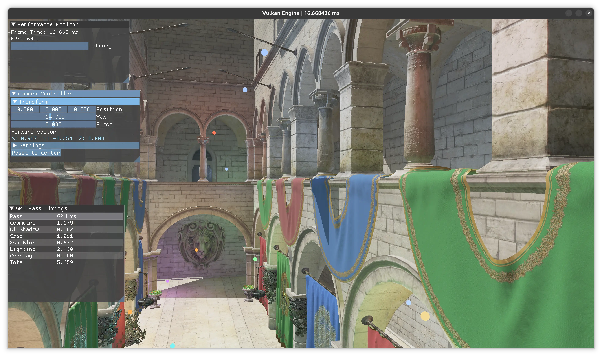
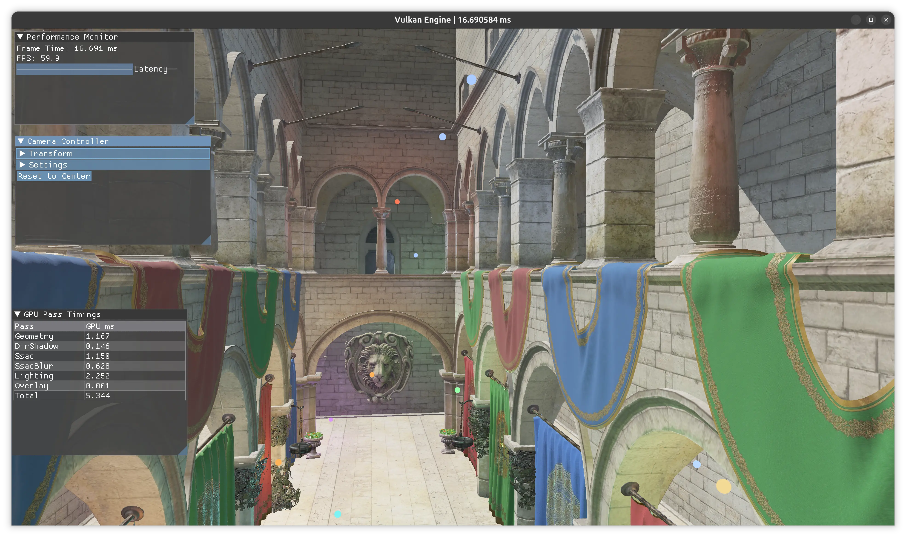

# Cascaded Shadow Maps — Design Walkthrough

## What CSM Does and Why

The single directional shadow map covers the entire scene with one 2048×2048 depth texture. That means a shadow texel near the camera covers roughly the same world area as one far in the distance — wasteful close up, too coarse far away. CSM fixes this by splitting the camera frustum into 4 depth bands (cascades) and fitting a separate shadow map to each. Close cascades get dense coverage; far cascades get coarser coverage where the eye can't resolve the difference anyway.

---

## The 9 Steps

### 1. `NUM_CASCADES = 4` constant ✓
`engineConfig::NUM_CASCADES = 4` added to `src/common/Config.hpp`. Also added the missing `#include <cstdint>` that the file needed but previously got transitively.

### 2. `ShadowMap` — one image, four layers ✓
`AttachmentImage depth_` (single 2D image) replaced by three raw members owned directly by `ShadowMap`:

```cpp
vk::Image     depthImage_{};     // VMA-allocated, arrayLayers = NUM_CASCADES
VmaAllocation depthAlloc_{};
vk::ImageView depthArrayView_{}; // e2DArray, all cascades — for sampler2DArrayShadow in lighting.frag
std::array<vk::ImageView, NUM_CASCADES> layerViews_{}; // one e2D per cascade — for DirShadowPass render targets
```

`AttachmentImage::create()` was dropped because it hardcodes `arrayLayers=1` and always creates an `e2D` view.
`getDepthView()` now returns the array view. `getLayerView(int i)` is new. Sampler unchanged (hardware PCF, reverse-Z).

### 3. `DirLightView` — compute 4 light-space matrices
This is the math-heavy step. For each cascade you need an orthographic matrix that tightly wraps that cascade's slice of the camera frustum.

**Split depths** — where to cut the camera frustum. The Practical Split Scheme blends a logarithmic split (biased toward near) with a uniform split using a `lambda` factor (0.9 = mostly logarithmic). This gives you something like: 0.1m → 5m → 20m → 60m → 200m.

> The renderer uses an infinite far plane for depth precision, so you can't use `cameraFar` here — it's `∞`. `DirLightView` gets a separate `shadowFar` field (e.g. 200m) as an independent tuning knob.

**Per-cascade ortho fitting** — for each split band:
1. Unproject the 8 NDC corners of that sub-frustum back to world space
2. Transform them into the light's view space
3. Compute the AABB of those 8 points → that becomes the orthographic bounds
4. **Texel snap**: round the XY center of that AABB to the nearest shadow texel. Without this, as the camera translates by a fraction of a meter the shadow map shifts by a full texel and shadows crawl. Snapping eliminates that.

### 4. `GlobalUBO` — 4 matrices instead of 1
Replace `dirLightSpaceMatrix` (one `mat4`) with `dirLightSpaceMatrices[4]` (four `mat4`s, +192 bytes). Add `cascadeSplitDepths` (a `vec4` holding the four cascade far-plane distances as positive meters from camera). The lighting shader needs both.

### 5. `DirShadowPass` — render 4 times
Loop over cascades. Each iteration: `beginRendering` targeting that cascade's layer view, clear it, draw all geometry with that cascade's light-space matrix in the push constants, `endRendering`. Same push constant struct as before — just a different matrix each time. No barriers between cascades because they write to distinct array layers.

### 6. Render graph — nothing changes
The render graph tracks the shadow map by image handle and emits one barrier: `eDepthStencilAttachmentOptimal → eShaderReadOnlyOptimal` before the lighting pass. The image being an array doesn't change that — the barrier covers the whole image regardless.

### 7. `lighting.frag` — pick a cascade, sample it
The shader now has `sampler2DArrayShadow` instead of `sampler2DShadow`. In `shadowFactor()`:
1. Compute `fragDist = -viewPos.z` (positive distance from camera; view-space Z is negative in right-hand coordinates)
2. Walk the 4 split distances: first cascade where `fragDist < splits[i]` wins
3. Project `worldPos` into that cascade's light space
4. Sample: `texture(shadowMap, vec4(uv, cascadeIndex, referenceDepth))` — the hardware PCF does the rest

### 8. Descriptor sets — bind the array view
One line change in `updateLightingInputsDescSets()`: use the array view (`e2DArray`, all 4 layers) instead of the single-layer depth view. Descriptor type stays `eCombinedImageSampler`.

### 9. GLSL constant
`#define NUM_CASCADES 4` in the fragment shader so the cascade-selection loop matches the C++ side.

---

---

## Demo

| CSM active — 4 cascades, PCF | Cascade debug tint overlay |
|---|---|
|  |  |

---

## Known Follow-ups

- **Cascade blend zones** — hard boundaries between cascades will be slightly visible. A `smoothstep` blend at the seam fixes it.
- ~~**Bounding sphere fit**~~ ✓ — replaced AABB texel snap with sphere-based snap (`radius = max corner distance from centroid`). Sphere radius is rotation-invariant so `texelSize = 2r / MAP_SIZE` is constant; the snap grid is stable regardless of camera orientation.
- **Depth clamp** — tall geometry that pokes past a cascade's far plane causes shadow holes. Enabling `VkPhysicalDeviceFeatures::depthClamp` fixes it with one flag.
