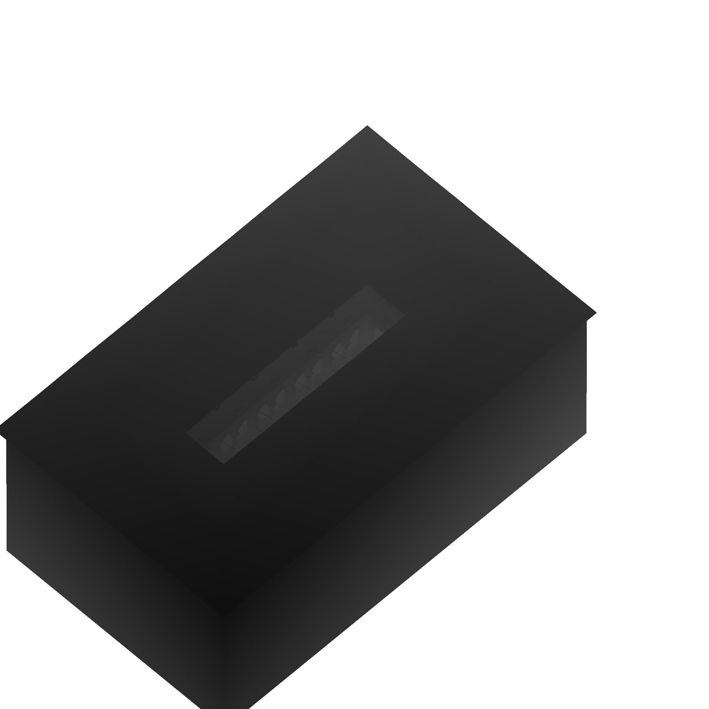
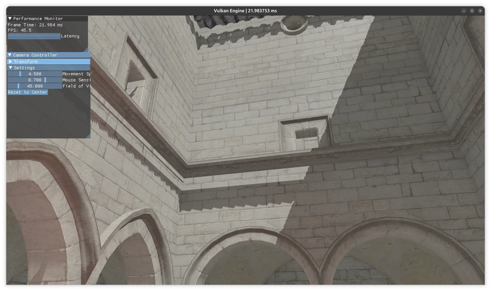

# Directional Shadow Map

Adding hard shadows to a deferred renderer requires a separate depth-only pre-pass rendered from the light's point of view. This document covers the full implementation: geometry, pipeline, descriptor wiring, and the lighting shader integration.

---

## Result

| Shadow Map Depth Buffer | Final Render |
|:-:|:-:|
|  |  |

---

## Overview

Deferred shading decouples lighting from geometry, which creates a natural insertion point for shadow maps: the shadow pass runs before the G-buffer pass, writes a depth image from the light's perspective, and the lighting pass samples it to determine visibility.

```
DirShadowPass   →   GeometryPass   →   SSAO   →   LightingPass
  (write depth)      (write G-buffer)              (read depth + shadow map)
```

---

## Shadow Map Pass

### Light Space Transform

The directional light is defined by a position, target, and orthographic frustum. The light-space matrix is `proj * view`, computed once per frame and uploaded via push constants for each draw.

```glsl
// dirShadow.vert
layout(push_constant) uniform ShadowData {
    mat4 lightSpaceMatrix; // proj * view from light's perspective
    mat4 model;
} pc;

void main() {
    gl_Position = pc.lightSpaceMatrix * pc.model * vec4(inPosition, 1.0);
}
```

The orthographic projection uses `glm::orthoRH_ZO` with `GLM_FORCE_DEPTH_ZERO_TO_ONE` so depth maps to `[0, 1]` directly — matching Vulkan's NDC convention.

```cpp
glm::mat4 projMatrix() const {
    glm::mat4 proj = glm::orthoRH_ZO(-orthoSize, orthoSize, -orthoSize, orthoSize, nearPlane, farPlane);
    proj[1][1] *= -1; // Vulkan Y-flip
    return proj;
}
```

### Depth Bias

Self-shadowing artefacts (shadow acne) arise because a surface compares its own depth against the shadow map — which stores an approximation of that same depth. Two mitigation layers are applied:

**Slope-scaled depth bias** in the pipeline (set dynamically):

```cpp
cmd.setDepthBias(1.25f, 0.0f, 1.75f);
// constantFactor=1.25  slopeFactor=1.75  clamp=0
```

**Front-face culling** in the shadow pipeline:

```cpp
.cullMode = vk::CullModeFlagBits::eFront
```

Rendering back faces stores slightly deeper values than the front faces that will receive the shadow test, providing a natural geometric offset. The slope-scaled bias handles steeply angled surfaces where the geometric offset alone is insufficient.

### Barriers

The shadow map transitions between two layouts each frame:

```
UNDEFINED → DEPTH_STENCIL_ATTACHMENT_OPTIMAL   (before shadow pass — discard, clear on load)
DEPTH_STENCIL_ATTACHMENT_OPTIMAL → SHADER_READ_ONLY_OPTIMAL  (after shadow pass — sample in lighting)
```

Both transitions use `synchronization2` (`pipelineBarrier2`) with explicit stage and access masks. The post-pass barrier:

```
srcStage:  eLateFragmentTests
srcAccess: eDepthStencilAttachmentWrite
dstStage:  eFragmentShader
dstAccess: eShaderRead
```

---

## Descriptor Layout

The shadow map is bound at **set 2, binding 4** — alongside the G-buffer RTs, SSAO, and depth — in what is called the `lightingInputs` descriptor set. This set aggregates everything the lighting pass needs to evaluate a fragment.

| Set | Binding | Resource |
|-----|---------|----------|
| 2 | 0 | Albedo + Metallic (G-buffer RT0) |
| 2 | 1 | Normal + Roughness (G-buffer RT1) |
| 2 | 2 | Depth (for world-position reconstruction) |
| 2 | 3 | SSAO blurred result |
| 2 | **4** | **Directional shadow map** |

The `dirLightSpaceMatrix` and `dirLightDir` are uploaded each frame through the `GlobalUBO` at set 0, binding 0. The `DirLightView` struct is owned by `App` and passed into `Renderer::drawFrame` alongside point lights — same pattern, consistent interface.

---

## Lighting Shader Integration

### Shadow Factor

The `shadowFactor()` function transforms a world-space position into light clip space, converts to UV, and compares depth against the shadow map. It returns `1.0` (fully lit) or `0.0` (fully shadowed).

```glsl
float shadowFactor(vec3 worldPos) {
    vec4 lightClip = ubo.dirLightSpaceMatrix * vec4(worldPos, 1.0);
    vec3 proj      = lightClip.xyz / lightClip.w;  // ortho: w=1, kept general
    vec2 shadowUV  = proj.xy * 0.5 + 0.5;          // NDC [-1,1] → UV [0,1]

    // Outside the light frustum → treat as fully lit
    if (any(lessThan(shadowUV, vec2(0.0))) || any(greaterThan(shadowUV, vec2(1.0))))
        return 1.0;
    if (proj.z < 0.0 || proj.z > 1.0)
        return 1.0;

    float closestDepth = texture(shadowMap, shadowUV).r;
    float currentDepth = proj.z;

    // Small receiver bias supplements the slope-scaled depth bias from the shadow pass
    float bias = 0.002;
    return currentDepth - bias < closestDepth ? 1.0 : 0.0;
}
```

The `proj.z` range check is required: fragments beyond the light's far plane have `proj.z > 1.0`. Without it, the comparison `currentDepth > closestDepth` always fails (shadow map max is 1.0), incorrectly shadowing everything outside the frustum.

### Directional Light BRDF

The shadow factor gates the directional light contribution. The Cook-Torrance BRDF is evaluated once via the shared `evalBRDF()` function — same function used by the point light loop, different `L` vector.

```glsl
// Directional light (shadow-mapped)
{
    vec3 L = normalize(-ubo.dirLightDir.xyz); // stored as light→scene; negate for frag→light
    vec3 H = normalize(V + L);
    float NdotL = max(dot(N, L), 0.0);
    float NdotH = max(dot(N, H), 0.0);
    float HdotV = max(dot(H, V), 0.0);

    const float dirLightIntensity = 4.0;
    vec3 radiance = vec3(dirLightIntensity); // white directional light

    float shadow = shadowFactor(worldPos);
    Lo += evalBRDF(surf, NdotV, NdotL, NdotH, HdotV) * radiance * NdotL * shadow;
}
```

---

## Pipeline Configuration

The shadow pipeline is depth-only — no fragment shader, no color attachments, no vertex attributes beyond position.

```cpp
dirShadowPipeline_ = buildPipeline({
    .vertSpv         = "shaders/shadow/dirShadow.vert.spv",
    // no fragSpv — depth-only pass
    .colorFormats    = {},
    .depthTestEnable = true,
    .depthWriteEnable = true,
    .depthBiasEnable = true,   // dynamic — set via cmd.setDepthBias()
    .cullMode        = vk::CullModeFlagBits::eFront,
}, dirShadowPipelineLayout_);
```

The shadow pipeline has its own `dirShadowPipelineLayout_` with a single push constant range (vertex stage only, 128 bytes: `lightSpaceMatrix` + `model`). No descriptor sets — all per-draw data is in push constants.

---

## Known Limitations

- **Hard shadows only** — no PCF filtering. Shadow edges are aliased, especially on surfaces at oblique angles to the light.
- **Single cascade** — the orthographic frustum is fixed. Objects outside the frustum are treated as lit. Large scenes will show unshadowed regions at the frustum boundary.
- **Fixed light position** — `DirLightView` defaults are tuned for the Sponza scene. The directional light is configurable at the `App` level but not exposed to the UI.

---

## Next Steps

- **PCF** — 3×3 tap loop in `shadowFactor()`, ~30 minutes, removes the hard-edge aliasing
- **Cascade Shadow Maps (CSM)** — split the frustum into N depth ranges, one shadow map per cascade; required for large scenes
